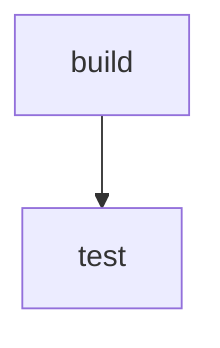

# pipedoc
**Pipedoc** automatically generates documentation and diagrams for your CI pipelines.
It parses your CI configuration (starting with GitHub Actions) and produces:

* A Markdown summary of jobs, dependencies, and steps
* A visual flowchart diagram using Mermaid for easy embedding in your repo

**Why use it?**
Keeping CI documentation up to date is a pain. Pipedoc does it for you automatically so new team members, contributors, or auditors can instantly understand how your pipeline flows.

**Features:**

* Parses GitHub Actions (GitLab CI & Jenkins support planned)
* Outputs Markdown & Mermaid diagrams for GitHub-friendly previews
* Lightweight CLI tool (single binary)
* Optional GitHub Action for auto-updating docs on changes

**Example output:**

**Notes**
* Your main CI file must be called ci.yml
